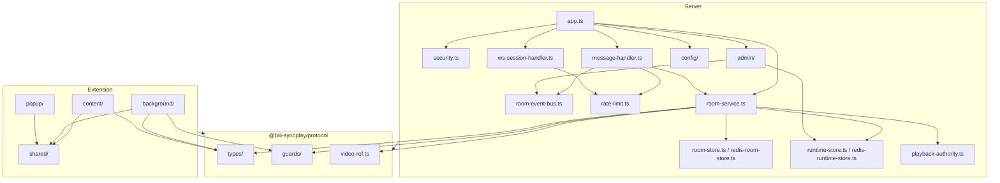
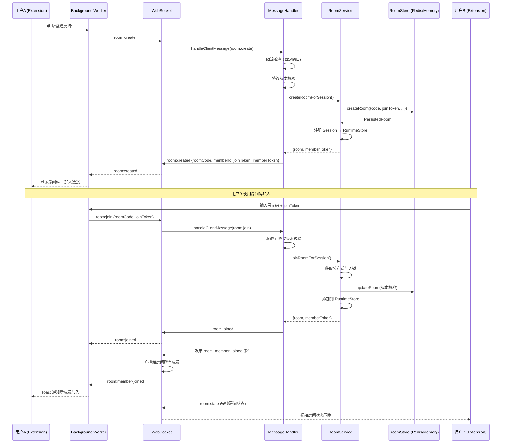
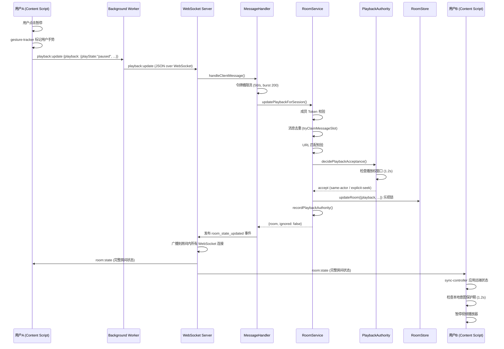

# Bili-SyncPlay 架构文档

## 1. 项目概览

**项目名称**: Bili-SyncPlay
**当前版本**: 1.2.4
**协议版本**: 3
**仓库**: Monorepo（npm workspaces），约 363 个源文件

Bili-SyncPlay 是一个异地同步观看 Bilibili 视频的系统。通过浏览器扩展捕获播放状态变化，经由 WebSocket 服务器实时广播到同房间的其他成员，实现播放/暂停/Seek/倍速的毫秒级同步。

**技术栈**:

| 层面 | 技术选型 |
|------|---------|
| 语言 | TypeScript 6（严格模式） |
| 运行时 | Node.js >=22.5.0 |
| 构建 | TypeScript Compiler（server/protocol），esbuild（extension） |
| 包管理 | npm workspaces |
| WebSocket | ws ^8.21.0 |
| Redis 客户端 | ioredis ^5.10.0 |
| 测试 | Node.js Test Runner（`--test` flag），无第三方测试框架 |
| 代码质量 | ESLint 10 + Prettier 3 + typescript-eslint 8 |
| CI/CD | GitHub Actions（CI 验证 + Redis 集成测试 + 性能基准线） |
| 容器化 | Docker（Node 22 Alpine 多阶段构建）+ Docker Compose |

**部署环境**: 本地开发 / Docker 容器 / 多节点集群（Redis 后端）

---

## 2. 模块分解与职责

### 2.1 Monorepo 结构

```
Bili-SyncPlay/
├── packages/protocol/      # 共享协议包（类型 + 守卫 + URL 规范化）
├── server/                 # WebSocket 服务端 + 管理面板
│   ├── src/                # 服务端源码
│   │   ├── admin/          # 管理面板后端（路由、鉴权、审计）
│   │   ├── bootstrap/      # 启动引导（HTTP 服务组装）
│   │   ├── config/         # 配置管理（环境变量解析、Schema）
│   │   └── *.ts            # 核心模块（房间、消息、安全、限流等）
│   ├── admin-ui/           # 管理面板前端（纯前端，无框架）
│   ├── test/               # 服务端测试
│   └── scripts/            # Redis 集成测试脚本
├── extension/              # 浏览器扩展
│   ├── src/
│   │   ├── background/     # Service Worker 后台逻辑
│   │   ├── content/        # Content Script（页面注入）
│   │   ├── popup/          # 弹出窗口 UI
│   │   └── shared/         # 共享工具（i18n、消息类型、URL）
│   ├── public/             # 静态资源（manifest, icons, popup HTML）
│   ├── scripts/            # 构建脚本（esbuild）
│   └── test/               # 扩展测试
├── bench/                  # 性能基准测试
├── docs/                   # 文档
├── scripts/                # 仓库级脚本（审计门控、发布打包）
└── .github/workflows/      # CI 流水线
```

### 2.2 模块职责详述

#### `packages/protocol/` — 协议包

单点真实来源（Single Source of Truth），所有通信合约定义于此：

| 文件 | 职责 |
|------|------|
| `types/common.ts` | 协议版本号、错误码枚举、播放状态类型 |
| `types/domain.ts` | 领域实体：`SharedVideo`、`PlaybackState`、`RoomMember`、`RoomState` |
| `types/client-message.ts` | 客户端→服务端消息类型（8 种消息） |
| `types/server-message.ts` | 服务端→客户端消息类型（6 种消息） |
| `guards/client-message.ts` | 客户端消息运行时类型守卫 |
| `guards/server-message.ts` | 服务端消息运行时类型守卫 |
| `guards/primitives.ts` | 基础类型守卫（如播放状态、同步意图） |
| `video-ref.ts` | Bilibili URL 规范化与视频引用解析 |

**零运行时依赖**：仅 TypeScript 标准库。

#### `server/` — WebSocket 服务端

核心模块：

| 文件 | 职责 |
|------|------|
| `index.ts` | 入口：加载配置、创建服务、启动 HTTP 监听 |
| `app.ts` | `createSyncServer()`：编排所有组件的工厂函数 |
| `message-handler.ts` | 消息分发路由器，处理 8 种客户端消息 |
| `room-service.ts` | 房间业务逻辑：创建/加入/离开/分享视频/更新播放/踢人 |
| `room-store.ts` | 持久化存储接口 + 内存实现（含乐观锁版本控制） |
| `redis-room-store.ts` | Redis 持久化实现（Lua 脚本保证原子性） |
| `runtime-store.ts` | 运行时内存状态：Session、房间成员、锁、事件计数 |
| `redis-runtime-store.ts` | Redis 运行时存储实现（跨节点状态共享） |
| `mirrored-runtime-store.ts` | 镜像运行时存储（本地 + 远程状态合并） |
| `room-event-bus.ts` | 房间事件总线接口 + 内存/空实现 |
| `redis-room-event-bus.ts` | Redis Pub/Sub 实现 |
| `room-event-consumer.ts` | 消费事件总线消息，广播给房间内 Session |
| `playback-authority.ts` | 播放权决策引擎：判断是否接受远端播放状态 |
| `rate-limit.ts` | 限流算法（固定窗口计数 + 令牌桶） |
| `security.ts` | Origin 校验、IP 限流、WebSocket 升级决策 |
| `ws-session-handler.ts` | WebSocket 连接生命周期管理 |
| `ws-heartbeat.ts` | WebSocket 心跳检测 |
| `room-reaper.ts` | 定时清理过期空房间 |
| `node-heartbeat.ts` | 多节点心跳上报 |
| `admin-command-bus.ts` | 管理命令总线（内存/Redis） |
| `admin-command-consumer.ts` | 消费管理命令（踢人、关闭房间等） |
| `active-room-registry.ts` | 活跃房间注册中心 |

配置层：

| 文件 | 职责 |
|------|------|
| `config/env.ts` | 环境变量解析工具 |
| `config/runtime-config-schema.ts` | 配置 Schema 定义（50+ 环境变量） |
| `config/runtime-config.ts` | 运行时配置加载入口 |
| `config/security-config.ts` | 安全配置验证 |
| `config/persistence-config.ts` | 持久化配置验证 |
| `config/admin-config.ts` | 管理面板配置验证 |

管理面板：

| 文件 | 职责 |
|------|------|
| `admin/router.ts` | 管理面板路由分发，RBAC 权限校验 |
| `admin/routes/auth-routes.ts` | 登录/登出 |
| `admin/routes/read-routes.ts` | 查询接口（房间列表、节点状态等） |
| `admin/routes/action-routes.ts` | 写操作接口（踢人、关闭房间等） |
| `admin/routes/system-routes.ts` | 系统接口（健康检查、指标） |
| `admin/auth-service.ts` | 认证服务 |
| `admin/auth-store.ts` | 认证存储 |
| `admin/csrf.ts` | CSRF 保护 |
| `admin/event-store.ts` | 事件存储（内存） |
| `admin/audit-log.ts` | 审计日志 |
| `admin/metrics.ts` | Prometheus 格式指标采集 |

#### `extension/` — 浏览器扩展

**Background（Service Worker）** — 扩展的核心逻辑：

| Controller | 职责 |
|------------|------|
| `socket-controller.ts` | WebSocket 连接管理、重连、健康探测 |
| `room-session-controller.ts` | 房间创建/加入/离开、服务端消息处理 |
| `share-controller.ts` | 视频分享逻辑、待分享状态管理 |
| `clock-controller.ts` | NTP 式时钟偏移补偿（基于 sync:ping/pong RTT） |
| `tab-controller.ts` | Bilibili 标签页追踪、共享视频标签页管理 |
| `message-controller.ts` | Popup/Content 消息路由到各 Controller |
| `server-message-controller.ts` | 服务端消息消费者 |
| `outgoing-message-controller.ts` | 出站消息队列 |
| `popup-state-controller.ts` | Popup 状态广播 |
| `server-url-controller.ts` | 服务端 URL 管理 |
| `diagnostics-controller.ts` | 诊断日志管理 |
| `runtime-sync-controller.ts` | 运行时状态持久化同步 |
| `state-store.ts` | 响应式状态存储 |
| `storage-manager.ts` | chrome.storage 持久化 |

**Content Script** — 注入到 Bilibili 页面：

| Controller | 职责 |
|------------|------|
| `sync-controller.ts` | 核心同步逻辑：应用远端状态、广播本地播放变化 |
| `playback-binding-controller.ts` | 视频播放器事件绑定与解绑 |
| `playback-apply.ts` | 播放状态应用（暂停、Seek、倍速） |
| `playback-reconcile.ts` | 播放状态调和（本地 vs 远端冲突解决） |
| `playback-broadcast.ts` | 播放事件广播到 background |
| `navigation-controller.ts` | 页面导航检测（SPA 路由变化） |
| `share-controller.ts` | 当前视频信息提取 |
| `room-state-controller.ts` | 房间状态应用、Toast 通知 |
| `player-binding.ts` | 视频元素查找与操控 |
| `gesture-tracker.ts` | 用户手势追踪（区分用户操作与程序化操作） |
| `soft-apply-controller.ts` | 软应用（防抖后应用远端状态） |
| `auto-share-next-controller.ts` | 自动分享下一个视频 |
| `festival-bridge.ts` | Bilibili 节日页面桥接 |
| `page-share-button.ts` | 页面分享按钮注入 |
| `toast.ts` | Toast 通知展示 |

**Popup** — 弹出窗口：

| 文件 | 职责 |
|------|------|
| `popup-view.ts` | 视图渲染 |
| `popup-store.ts` | 状态管理 |
| `popup-actions.ts` | 用户操作处理 |
| `popup-render.ts` | 模板渲染 |
| `state-sync.ts` | 与 background 的状态同步 |
| `server-url-draft.ts` | 服务端 URL 草稿验证 |

### 2.3 模块依赖关系



---

## 3. 架构风格与设计模式

### 3.1 整体架构风格

**分层架构 + 事件驱动 + 策略模式**

- **协议层**（`packages/protocol/`）：定义通信契约，零业务逻辑
- **传输层**（WebSocket + `ws-session-handler`）：处理连接生命周期、消息序列化为 JSON
- **消息路由层**（`message-handler.ts`）：基于消息类型的分发路由器
- **业务层**（`room-service.ts`）：房间 CRUD、播放权决策、用户操作
- **存储层**（`RoomStore` / `RuntimeStore`）：通过接口抽象，支持内存和 Redis 两种策略
- **事件总线层**（`RoomEventBus`）：房间事件的发布/订阅，支持跨节点广播

### 3.2 关键设计模式

**策略模式（Strategy）**

- `RoomStore` 接口定义了 `createRoom`、`updateRoom`、`deleteRoom` 等操作，分别有 `createInMemoryRoomStore()` 和 Redis 实现
- `RuntimeStore` 接口同样有内存和 Redis 两个实现
- `RoomEventBus` 有 Noop、InMemory、Redis Pub/Sub 三种实现
- 由 `PersistenceConfig.provider` 环境变量在启动时注入具体实现

```typescript
// server/src/app.ts 中的依赖注入
const { roomStore, runtimeStore, roomEventBus, ... } =
  await createServerBootstrapContext(persistenceConfig, dependencies, ...);
```

**工厂模式（Factory）**

- `createSyncServer()`：服务端工厂，编排所有组件并返回带 `close()` 方法的 Server 实例
- `createRoomService()`：房间服务工厂
- `createMessageHandler()`：消息处理器工厂
- 每个 Controller 都有对应的 `createXxxController()` 工厂函数

**观察者模式（Observer）**

- `RoomEventBus.subscribe()` 允许注册事件消费者
- 扩展中的 `stateStore` 通过 getter/setter 响应式通知 UI 更新
- `popupStateController.broadcastPopupState()` 广播状态到所有 Popup 实例

**命令模式（Command）**

- 管理命令通过 `AdminCommandBus` 发布/消费，支持跨节点执行（踢人、关闭房间等）
- 命令携带 `instanceId` 标签，消费者仅处理非本实例发出的命令，避免自消费

**中介者模式（Mediator）**

- `message-controller.ts` 作为 Background 的中介者，将 Popup/Content 发来的消息路由到正确的 Controller
- `room-service.ts` 作为房间操作的中介者，协调存储层、运行时状态和事件总线

**职责链（Chain of Responsibility）**

- 管理面板路由：`handleSystemRoutes → handleAuthRoutes → handleReadRoutes → handleActionRoutes`，按顺序匹配
- WebSocket 升级决策：`evaluateUpgrade()` 依次检查限流 → Origin → 连接数

**装饰器模式（Decorator）**

- `MirroredRuntimeStore`：包装 `RuntimeStore`，在内存存储基础上镜像来自 Redis 的远程节点状态
- 扩展中各 Controller 通过注入回调形成功能增强链

---

## 4. 数据流与控制流

### 4.1 核心业务流程：创建房间并加入



### 4.2 核心业务流程：播放同步



### 4.3 异步机制

| 机制 | 位置 | 作用 |
|------|------|------|
| 消息去重槽 | `RuntimeStore.tryClaimMessageSlot()` | 基于 `seq` 号的幂等处理，防止重复广播 |
| 分布式加入锁 | `acquireDistributedJoinLock()` | Redis SET NX + 进程内队列，防止并发加入导致房间成员超限 |
| 发布背压 | `firePublishRoomEvent()` | 限制最大 256 个待发布，超时 5s 后丢弃，防止 Redis 慢查询阻塞消息流 |
| 定时清理 | `room-reaper.ts` | 每 60s 扫描一次，删除 `expiresAt < now` 的空房间 |
| 节点心跳 | `node-heartbeat.ts` | 每 5s 上报节点状态到 Redis，过期则标记为 offline |
| WebSocket 心跳 | `ws-heartbeat.ts` | 检测死连接，定期 ping/pong |
| 时钟同步 | `clock-controller.ts` | NTP 式 RTT 补偿，通过 sync:ping/pong 计算客户端-服务器时间偏移 |

---

## 5. 技术选型与中间件

### 5.1 核心依赖

| 依赖 | 版本 | 用途 |
|------|------|------|
| TypeScript | 6.0.3 | 类型系统 |
| ws | 8.21.0 | WebSocket 服务器 |
| ioredis | 5.10.0 | Redis 客户端（可选，多节点部署时启用） |
| esbuild | 0.28.1 | 扩展打包（Chrome/Firefox 双目标） |
| tsx | 4.20.6 | 开发时 ts 执行 + 测试运行器 |

### 5.2 数据存储

**默认模式（单节点）**：
- 所有状态存储在内存 Map 中
- 进程重启后数据丢失

**持久化模式（Redis）**：

| 数据类型 | Redis 结构 | 用途 |
|----------|-----------|------|
| 房间数据 | Hash (JSON) | 房间元数据 + 乐观锁版本 |
| 房间过期索引 | Sorted Set | 按 `expiresAt` 排序，Lua 脚本批量清理 |
| 运行时状态 | Hash | Session、房间成员、分布式锁 |
| 房间事件 | Pub/Sub | 跨节点广播房间状态变化 |
| 管理命令 | Pub/Sub | 跨节点执行管理操作 |
| 节点心跳 | Hash + TTL | 集群健康检查 |
| 审计日志 | List | 管理操作审计 |
| 管理会话 | Hash + TTL | Admin Session Cookie |

Redis 操作使用 Lua 脚本保证原子性（如 `DELETE_EXPIRED_ROOMS_LUA` 同时清理房间数据和过期索引）。

### 5.3 无数据库

项目不使用传统关系数据库或文档数据库。所有数据为**有状态的会话数据**（房间、成员、播放状态），设计上采用有界生命周期——空房间自动过期清理。

---

## 6. 部署与运维视角

### 6.1 构建方式

```bash
npm install                    # 安装依赖
npm run build                  # 按依赖序构建: protocol → server + extension
npm run build:extension        # 仅构建 Chrome 扩展
npm run build:extension:firefox # 构建 Firefox 扩展
npm run build:release          # 打包 Chrome zip + Firefox xpi
```

### 6.2 配置管理

所有配置通过环境变量注入，由 `config/runtime-config-schema.ts` 中的 Schema 定义校验规则（50+ 个环境变量）。

关键环境变量：

| 变量 | 类型 | 默认值 | 说明 |
|------|------|--------|------|
| `PORT` | integer | 8787 | HTTP/WebSocket 监听端口 |
| `ALLOWED_ORIGINS` | CSV | (空) | 允许的扩展 Origin |
| `ROOM_STORE_PROVIDER` | enum | `memory` | 房间存储后端 |
| `RUNTIME_STORE_PROVIDER` | enum | `memory` | 运行时存储后端 |
| `ROOM_EVENT_BUS_PROVIDER` | enum | `none` | 事件总线后端 |
| `REDIS_URL` | string | (空) | Redis 连接字符串 |
| `ADMIN_USERNAME` | string | (空) | 管理员用户名 |
| `ADMIN_PASSWORD_HASH` | string | (空) | 密码 SHA-256 哈希 |
| `ADMIN_SESSION_SECRET` | string | (空) | Session 签名密钥 |
| `MAX_MEMBERS_PER_ROOM` | positiveInteger | 100 | 房间最大成员数 |
| `INSTANCE_ID` | string | (自动生成) | 节点唯一标识 |

### 6.3 CI/CD

**CI 流水线**（`.github/workflows/ci.yml`）三个并行 Job：

1. **verify**: audit → lint → format → typecheck → build → coverage → Firefox 构建
2. **redis-integration**: 启动 Redis 容器，运行 Redis 集成测试
3. **benchmark-baseline**: 运行轻量级性能基准，上传结果作为 Artifact

**Docker 构建**（`Dockerfile`）：

- 多阶段构建：builder 阶段编译，运行阶段仅拷贝 `node_modules` + `dist`
- 删除 npm CLI 减少供应链攻击面
- 非 root 用户运行
- 内建健康检查（`/healthz` 端点）
- 暴露 8787 端口

### 6.4 日志与监控

- **结构化日志**：`LogEvent` 类型统一日志事件，每个事件包含 `sessionId`、`roomCode`、`result` 等上下文字段
- **Prometheus 指标**：`admin/metrics.ts` 采集连接数、消息延迟、发布丢弃数等指标，通过 `/metrics` 端点暴露
- **审计日志**：管理操作记录到 EventStore，支持按时间/操作类型/操作人查询

---

## 7. 安全与鉴权

### 7.1 扩展→服务端认证

**三层防护**：

1. **Origin 校验**（`security.ts`）：WebSocket 升级时校验 `Origin` header，仅允许配置的扩展 Origin（`chrome-extension://<id>` / `moz-extension://<uuid>`）。Firefox 公共部署支持 `ALLOW_ANY_FIREFOX_EXTENSION_ORIGIN` 模式，仅接受 `moz-extension://` scheme 的裸 Origin。

2. **Token 机制**：
   - `joinToken`：房间级别的加入凭证，服务端生成
   - `memberToken`：成员级别的会话凭证，每次加入新房间重新生成
   - 每条客户端消息携带 `memberToken`，`room-service.ts` 的 `requireMemberToken()` 校验 Token 是否与当前 Session 一致

3. **限流**：
   - 连接层：`connectionAttemptsPerMinute`（默认 60/min）+ `maxConnectionsPerIp`（默认 100/IP）
   - 消息层：固定窗口计数（房间创建/加入/分享/同步请求）+ 令牌桶（播放更新/同步 Ping）

### 7.2 管理面板鉴权

**RBAC 三级权限模型**：

| 角色 | 权限 |
|------|------|
| `viewer` | 只读查看 |
| `operator` | 查询 + 部分操作（踢人、断开连接） |
| `admin` | 全部操作 |

**安全措施**：
- Bearer Token 认证（`requireAdmin()` 中间件）
- CSRF 保护（写操作校验 Origin，`requireAdminWriteOrigin()`）
- 登录失败限流（IP + 用户名双重限流）
- Session Cookie 带 `httpOnly`、`secure`、`SameSite=Strict`
- 审计日志记录所有写操作

### 7.3 其他安全特性

- **代理 IP 透传**：`X-Forwarded-For` 解析，支持可信代理列表
- **WebSocket 心跳**：检测死连接，防止资源耗尽
- **消息大小限制**：`maxMessageBytes`（默认 16KB）
- **无效消息关闭**：超过阈值后自动断开连接
- **被踢成员隔离**：`blockMemberToken()` 记录被踢成员的 Token 及过期时间，阻止重连

---

## 8. 架构优缺点与改进建议

### 8.1 架构亮点

1. **协议中心化**：`packages/protocol/` 作为唯一消息合约来源，扩展和服务端共享类型定义，编译时保证一致性
2. **存储层策略抽象**：`RoomStore`/`RuntimeStore`/`RoomEventBus` 的接口-实现分离，内存与 Redis 切换仅需改环境变量
3. **播放权决策引擎**：`playback-authority.ts` 实现了精细的播放权窗口机制，在 1.2s 窗口内优先保留发起播放操作的用户控制权，有效减少多用户同时操作时的状态冲突
4. **消息幂等性**：基于 `seq` 号的消息去重槽（`tryClaimMessageSlot`），防止网络重传导致的重复处理
5. **无前端框架依赖**：扩展使用纯 TypeScript + 原生 DOM API，无 Vue/React 依赖，减小打包体积、提升加载速度
6. **完善的测试覆盖**：Node.js 原生测试 + Redis 集成测试 + 性能基准测试，CI 三道门控

### 8.2 潜在风险

1. **Redis 单点故障**：多节点模式下所有持久化层依赖单 Redis 实例，无 Sentinel 或 Cluster 高可用方案。Redis 宕机时集群将退化为不可用状态
2. **扩展兼容性风险**：Browser Extension Manifest V3 的限制（如 Service Worker 生命周期、网络请求限制）可能在 Chrome 更新时引入行为变化
3. **Bilibili 页面结构耦合**：Content Script 直接操作 Bilibili 页面 DOM（`player-binding.ts` 查找视频元素），Bilibili 前端改版可能导致扩展功能失效
4. **无数据持久化保障**：内存模式下进程重启即丢失所有房间数据；Redis 模式下无 AOF/RDB 恢复策略，且设计上房间本身为有界生命周期

### 8.3 改进建议

1. **引入 Redis Sentinel/Cluster 支持**
   - `ioredis` 原生支持 Sentinel 和 Cluster 模式
   - 可在 `persistence-config` 中添加 `redisSentinelMasterName` 和 `redisSentinelAddresses` 配置项
   - 实现成本较低，收益是高可用性保障

2. **Bilibili 页面适配层抽象**
   - 当前 `player-binding.ts` 中的选择器直接绑定 Bilibili 的 DOM 结构
   - 建议抽取 `PlayerAdapter` 接口，将选择器逻辑隔离为可替换的适配器
   - 当 Bilibili 前端改版时，只需更新适配器而非重写同步逻辑

3. **管理面板接入前端框架**
   - 当前管理面板使用纯前端 JavaScript（`admin-ui/*.js`），约 8 个文件
   - 随着功能增长（集群管理、实时监控、操作回滚），建议迁移至轻量级框架（如 Preact 或 Solid）
   - 或使用 SSR 方案预渲染首屏，提升初始加载速度

---

## 附录：关键配置摘要

### 环境变量全表（服务端）

```
# 网络
PORT=8787                          # 主服务端口
GLOBAL_ADMIN_PORT=                 # 全局管理面板端口
METRICS_PORT=                      # 指标采集端口

# 安全
ALLOWED_ORIGINS=chrome-extension://<id>  # 允许的 Origin（逗号分隔）
ALLOW_MISSING_ORIGIN_IN_DEV=false         # 开发环境放行
ALLOW_ANY_FIREFOX_EXTENSION_ORIGIN=false  # 允许任意 Firefox 扩展 Origin
TRUSTED_PROXY_ADDRESSES=                 # 可信代理 IP 列表
MAX_CONNECTIONS_PER_IP=100               # 每 IP 最大连接数
CONNECTION_ATTEMPTS_PER_MINUTE=60        # 每分钟连接尝试上限
MAX_MEMBERS_PER_ROOM=100                 # 房间最大成员数
MAX_MESSAGE_BYTES=16384                  # 最大消息字节数
INVALID_MESSAGE_CLOSE_THRESHOLD=10       # 无效消息阈值（超过后断开）
WS_HEARTBEAT_ENABLED=true                # WebSocket 心跳开关
WS_HEARTBEAT_INTERVAL_MS=30000           # 心跳间隔

# 限流
RATE_LIMIT_ROOM_CREATE_PER_MINUTE=5      # 每分钟房间创建上限
RATE_LIMIT_ROOM_JOIN_PER_MINUTE=10       # 每分钟房间加入上限
RATE_LIMIT_VIDEO_SHARE_PER_10_SECONDS=3  # 10秒内视频分享上限
RATE_LIMIT_PLAYBACK_UPDATE_PER_SECOND=50 # 每秒播放更新上限
RATE_LIMIT_PLAYBACK_UPDATE_BURST=200     # 播放更新突发上限
RATE_LIMIT_SYNC_REQUEST_PER_10_SECONDS=5 # 10秒内同步请求上限
RATE_LIMIT_SYNC_PING_PER_SECOND=10       # 每秒同步 Ping 上限
RATE_LIMIT_SYNC_PING_BURST=50            # 同步 Ping 突发上限

# 持久化
ROOM_STORE_PROVIDER=memory|redis         # 房间存储后端
RUNTIME_STORE_PROVIDER=memory|redis      # 运行时存储后端
ROOM_EVENT_BUS_PROVIDER=none|memory|redis # 事件总线后端
ADMIN_COMMAND_BUS_PROVIDER=none|memory|redis  # 管理命令总线后端
REDIS_URL=                               # Redis 连接字符串
REDIS_NAMESPACE=                         # Redis Key 命名空间
NODE_HEARTBEAT_ENABLED=true              # 节点心跳开关
NODE_HEARTBEAT_INTERVAL_MS=5000          # 心跳上报间隔
NODE_HEARTBEAT_TTL_MS=15000             # 心跳过期时间
EMPTY_ROOM_TTL_MS=60000                 # 空房间存活时间
ROOM_CLEANUP_INTERVAL_MS=60000          # 房间清理间隔
INSTANCE_ID=                            # 节点标识（自动生成）

# 管理面板
ADMIN_USERNAME=                          # 管理员用户名
ADMIN_PASSWORD_HASH=sha256:<hex>         # 密码哈希
ADMIN_SESSION_SECRET=<random>            # Session 密钥
ADMIN_UI_DEMO_ENABLED=false              # 演示模式开关
GLOBAL_ADMIN_ENABLED=false               # 全局管理面板开关
```

### 客户端→服务端消息类型

| 消息类型 | 用途 | 限流策略 |
|----------|------|---------|
| `room:create` | 创建房间 | 固定窗口 |
| `room:join` | 加入房间 | 固定窗口 |
| `room:leave` | 离开房间 | 无限流 |
| `profile:update` | 更新昵称 | 无限流 |
| `video:share` | 分享视频 | 固定窗口 |
| `playback:update` | 播放状态更新 | 令牌桶（高频） |
| `sync:request` | 请求同步 | 固定窗口 |
| `sync:ping` | 时钟同步探测 | 令牌桶 |

### 服务端→客户端消息类型

| 消息类型 | 用途 |
|----------|------|
| `room:created` | 房间创建成功 |
| `room:joined` | 加入房间成功 |
| `room:state` | 完整房间状态快照 |
| `room:member-joined` | 成员加入通知 |
| `room:member-left` | 成员离开通知 |
| `error` | 错误响应 |
| `sync:pong` | 时钟同步回复 |