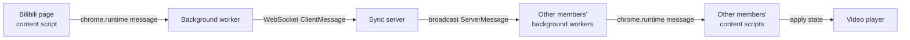

# Architecture Overview

[English](./architecture.md) | [简体中文](./architecture.zh-CN.md)

This document orients contributors in the runtime architecture: what the moving parts are, how a playback change travels through the system, and where new code belongs. Module-boundary rules live in [CONTRIBUTING.md](../CONTRIBUTING.md); the wire protocol is specified in the [protocol reference](./reference/protocol.md).

## System Parts

| Part              | Location             | Runtime                                                                                 |
| ----------------- | -------------------- | --------------------------------------------------------------------------------------- |
| Browser extension | `extension/`         | MV3; service-worker background on Chrome/Edge, event-page background on Firefox 121+    |
| Sync server       | `server/`            | Node.js WebSocket server plus admin panel; optional Redis for multi-node deployments    |
| Protocol package  | `packages/protocol/` | Shared TypeScript types, type guards, and Bilibili URL normalization used by both sides |

## Sync Data Flow

1. The content script detects playback changes (play, pause, seek, rate) on a supported Bilibili page.
2. It sends the change to the background worker via `chrome.runtime` messaging.
3. The background worker validates it, updates room state, and forwards it to the WebSocket server as a `playback:update`.
4. The server stamps `serverTime`, persists room state, and broadcasts to all room members (across nodes via the Redis room event bus when configured).
5. Receiving clients apply the playback state to their video player, correcting for clock offset.

The reverse path (someone else's update arriving) flows server → background → content script, where reconcile logic decides whether to seek, change rate, or toggle play state. An NTP-style `sync:ping` / `sync:pong` exchange maintains the clock offset (see the [protocol reference](./reference/protocol.md#clock-synchronization)).

## Extension

Each entry area follows the same shape: `index.ts` is assembly-only, runtime state lives in a dedicated store, and behavior lives in named controllers.

### Background (`extension/src/background/`)

State lives in `state-store.ts`. Key controllers:

| Controller                   | Responsibility                                         |
| ---------------------------- | ------------------------------------------------------ |
| `socket-controller.ts`       | WebSocket connection, reconnection, health checks      |
| `room-session-controller.ts` | Room create / join / leave / state                     |
| `share-controller.ts`        | Shared video and pending local shares                  |
| `clock-controller.ts`        | NTP-style clock offset for playback sync               |
| `tab-controller.ts`          | Bilibili tab tracking, shared vs. local page switching |
| `message-controller.ts`      | Routes popup / content messages to handlers            |

Supporting modules handle server-message dispatch (`server-message-controller.ts`), the popup connection (`popup-state-controller.ts`, `popup-bus.ts`), the server URL lifecycle (`server-url-controller.ts`), and persistence (`storage-manager.ts`).

### Content script (`extension/src/content/`)

State lives in `content-store.ts`. The main concerns are playback binding and broadcast (`playback-binding-controller.ts`, `playback-broadcast.ts`), applying and reconciling remote state (`room-state-apply-controller.ts`, `playback-reconcile.ts`, `soft-apply-controller.ts`), SPA navigation tracking (`navigation-controller.ts`), page-world bridging for player internals and festival pages (`page-bridge*.ts`, `festival-bridge.ts`), sharing (`share-controller.ts`, `auto-share-next-controller.ts`), and in-page toasts (`toast.ts`).

### Popup (`extension/src/popup/`)

Local UI state lives in `popup-store.ts`; template, refs/render, actions, and the background port connection are separate modules (`popup-template.ts`, `popup-render.ts`, `popup-actions.ts`, `popup-port.ts`).

### Shared (`extension/src/shared/`)

Cross-area helpers: normalized video URL handling (`url.ts`, wrapping the protocol package), extension-internal message contracts (`messages.ts`), i18n strings (`i18n.ts`), and storage helpers (`storage.ts`). Anything needed by more than one entry area belongs here, not redefined per entrypoint.

## Server (`server/src/`)

`app.ts` is runtime assembly only; `index.ts` (room node) and `global-admin-index.ts` (dedicated admin process) are the two entrypoints.

| Layer               | Modules                                                                                            | Responsibility                                                      |
| ------------------- | -------------------------------------------------------------------------------------------------- | ------------------------------------------------------------------- |
| Config              | `config/*`                                                                                         | Env / config-file parsing (the only place env vars are read)        |
| Bootstrap           | `bootstrap/*`                                                                                      | Provider selection and dependency wiring                            |
| Session handling    | `ws-session-handler.ts`, `message-handler.ts`, `rate-limit.ts`, `security.ts`, `origin.ts`         | Handshake checks, message validation, auth, rate limits             |
| Room domain         | `room-service.ts`, `room-store.ts`, `playback-authority.ts`, `room-reaper.ts`                      | Room lifecycle, playback-state authority, expiry cleanup            |
| Multi-node plumbing | `redis-*.ts`, `room-event-bus.ts`, `admin-command-bus.ts`, `runtime-store.ts`, `node-heartbeat.ts` | Redis-backed stores, cross-node fanout, command routing, heartbeats |
| Admin               | `admin/*`, `admin-panel.ts`, `admin-session-store.ts`                                              | Admin panel UI, routes, sessions, events, audit logs                |

Every store and bus has a `memory` and a `redis` provider behind the same interface; the [multi-node guide](./operations/multi-node.md) describes which providers must be enabled for a multi-node topology.

## Identity and State Lifetimes

- A room is identified by `roomCode`; joining requires the `joinToken` from the invite (`roomCode:joinToken`), and every subsequent room message requires the session-bound `memberToken` returned by join. A rejoin that presents a still-valid previous `memberToken` keeps its member identity and reuses that token; otherwise the server issues a new one. The extension keeps its cached `memberToken` across automatic reconnects and presents it when rejoining; the token is cleared only on explicit leave or when the server tears down the session (e.g. an admin kick).
- The extension splits persisted state by lifetime: `chrome.storage.session` holds room membership (cleared when the browser closes), `chrome.storage.local` holds `displayName` and `serverUrl`. Practical consequences are listed in the [development guide](./development.md#state-persistence).

## Where New Code Belongs

- New behavior goes into an existing named module or a new controller — never into a growing `index.ts`.
- New state goes behind the relevant store, not into a top-level mutable variable.
- Protocol changes go through `packages/protocol` with the versioning checklist in [CONTRIBUTING.md](../CONTRIBUTING.md).
- New server settings go through the config layer and must be documented in the [environment variable reference](./reference/security-env.md).
