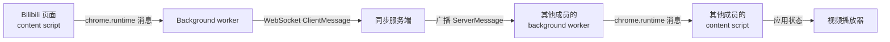

# 架构概览

[English](./architecture.md) | [简体中文](./architecture.zh-CN.md)

本文档帮助贡献者建立对运行时架构的整体认知：系统由哪些部分组成、一次播放变化如何在系统中流转、新代码应该放在哪里。模块边界规则见 [CONTRIBUTING.md](../CONTRIBUTING.md)；线上协议规范见[协议参考](./reference/protocol.zh-CN.md)。

## 系统组成

| 组成部分   | 位置                 | 运行时                                                                   |
| ---------- | -------------------- | ------------------------------------------------------------------------ |
| 浏览器扩展 | `extension/`         | MV3；Chrome/Edge 为 service worker 后台，Firefox 121+ 为 event page 后台 |
| 同步服务端 | `server/`            | Node.js WebSocket 服务 + 管理后台；多节点部署时使用可选的 Redis          |
| 协议包     | `packages/protocol/` | 两端共享的 TypeScript 类型、类型守卫和 Bilibili URL 归一化               |

## 同步数据流

1. content script 在受支持的 Bilibili 页面上检测播放变化（播放、暂停、跳转、倍速）。
2. 通过 `chrome.runtime` 消息发送给 background worker。
3. background worker 校验后更新房间状态，并以 `playback:update` 转发给 WebSocket 服务端。
4. 服务端盖上 `serverTime`、持久化房间状态，并向所有房间成员广播（配置 Redis room event bus 时可跨节点）。
5. 接收端把播放状态应用到自己的视频播放器上，并校正时钟偏移。

反向路径（收到别人的更新）为 服务端 → background → content script，由 reconcile 逻辑决定是否 seek、调倍速或切换播放状态。NTP 式的 `sync:ping` / `sync:pong` 往返维护时钟偏移（见[协议参考](./reference/protocol.zh-CN.md#时钟同步)）。

## 扩展端

三个入口区域遵循同一套形态：`index.ts` 只负责装配，运行态收敛在专属 store，行为放在具名 controller 中。

### Background（`extension/src/background/`）

状态收敛在 `state-store.ts`。核心 controller：

| Controller                   | 职责                                      |
| ---------------------------- | ----------------------------------------- |
| `socket-controller.ts`       | WebSocket 连接、重连、健康检查            |
| `room-session-controller.ts` | 房间创建 / 加入 / 离开 / 状态             |
| `share-controller.ts`        | 共享视频与待处理的本地分享                |
| `clock-controller.ts`        | NTP 式时钟偏移，用于播放同步              |
| `tab-controller.ts`          | Bilibili 标签页跟踪、共享页与本地页切换   |
| `message-controller.ts`      | 把 popup / content 消息路由到对应 handler |

辅助模块负责服务端消息分发（`server-message-controller.ts`）、popup 连接（`popup-state-controller.ts`、`popup-bus.ts`）、服务器地址生命周期（`server-url-controller.ts`）和持久化（`storage-manager.ts`）。

### Content script（`extension/src/content/`）

状态收敛在 `content-store.ts`。主要关注点：播放绑定与广播（`playback-binding-controller.ts`、`playback-broadcast.ts`）、远端状态应用与调和（`room-state-apply-controller.ts`、`playback-reconcile.ts`、`soft-apply-controller.ts`）、SPA 导航跟踪（`navigation-controller.ts`）、访问播放器内部与 festival 页面的页面世界桥接（`page-bridge*.ts`、`festival-bridge.ts`）、分享（`share-controller.ts`、`auto-share-next-controller.ts`）以及页内 toast（`toast.ts`）。

### Popup（`extension/src/popup/`）

本地 UI 状态收敛在 `popup-store.ts`；模板、refs/渲染、动作和 background 端口连接各自独立（`popup-template.ts`、`popup-render.ts`、`popup-actions.ts`、`popup-port.ts`）。

### Shared（`extension/src/shared/`）

跨区域 helper：归一化视频 URL 处理（`url.ts`，封装协议包）、扩展内部消息契约（`messages.ts`）、i18n 文案（`i18n.ts`）和存储 helper（`storage.ts`）。任何被多个入口区域使用的逻辑都应沉淀在这里，而不是各入口各写一份。

## 服务端（`server/src/`）

`app.ts` 只负责运行时装配；`index.ts`（Room Node）和 `global-admin-index.ts`（独立管理进程）是两个入口。

| 层次       | 模块                                                                                               | 职责                                           |
| ---------- | -------------------------------------------------------------------------------------------------- | ---------------------------------------------- |
| 配置       | `config/*`                                                                                         | 环境变量 / 配置文件解析（读取 env 的唯一位置） |
| Bootstrap  | `bootstrap/*`                                                                                      | provider 选择与依赖装配                        |
| 会话处理   | `ws-session-handler.ts`、`message-handler.ts`、`rate-limit.ts`、`security.ts`、`origin.ts`         | 握手检查、消息校验、鉴权、限流                 |
| 房间领域   | `room-service.ts`、`room-store.ts`、`playback-authority.ts`、`room-reaper.ts`                      | 房间生命周期、播放状态权威、过期清理           |
| 多节点管道 | `redis-*.ts`、`room-event-bus.ts`、`admin-command-bus.ts`、`runtime-store.ts`、`node-heartbeat.ts` | Redis 后端存储、跨节点广播、命令路由、心跳     |
| 管理后台   | `admin/*`、`admin-panel.ts`、`admin-session-store.ts`                                              | 管理面板 UI、路由、会话、事件、审计日志        |

每个 store 和 bus 都在同一接口后提供 `memory` 和 `redis` 两种实现；多节点拓扑需要启用哪些 provider 见[多节点部署指南](./operations/multi-node.zh-CN.md)。

## 身份与状态生命周期

- 房间由 `roomCode` 标识；加入需要邀请串（`roomCode:joinToken`）中的 `joinToken`，之后每条房间消息都需要加入时返回的会话绑定 `memberToken`。重连携带仍有效的旧 `memberToken` 时会保留原成员身份并复用该 token；否则服务端签发新 token。扩展在自动重连时会保留缓存的 `memberToken` 并随重新加入一起发送；只有显式离开房间或服务端主动终止会话（如管理员踢人）时才会清除该 token。
- 扩展按生命周期拆分持久化状态：`chrome.storage.session` 保存房间成员信息（浏览器关闭即清除），`chrome.storage.local` 保存 `displayName` 与 `serverUrl`。实际影响见[开发指南](./development.zh-CN.md#状态持久化)。

## 新代码应该放在哪里

- 新行为放进已有具名模块或新建 controller——不要继续拉长 `index.ts`。
- 新状态放进对应 store，不要新增顶层可变变量。
- 协议变更走 `packages/protocol`，并遵循 [CONTRIBUTING.md](../CONTRIBUTING.md) 的版本清单。
- 新服务端配置走 config 层，并同步补进[环境变量参考](./reference/security-env.zh-CN.md)。
