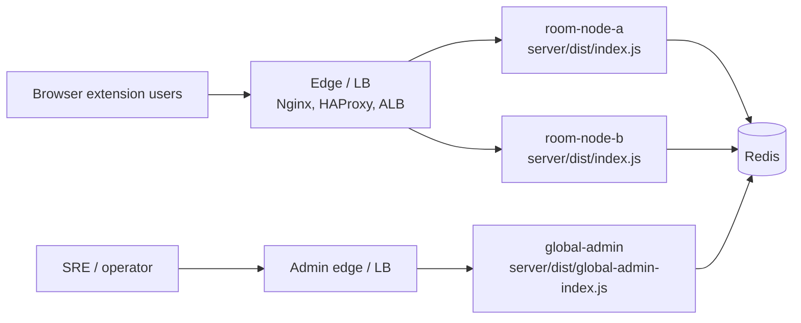

# Bili-SyncPlay Multi-Node Operations Runbook

[English](./multi-node-operations.md) | [简体中文](./multi-node-operations.zh-CN.md)

This document is written for day-to-day operations and on-call response. It covers scaling multiple room nodes, the dedicated global admin, Redis-backed shared control plane, Redis incidents, admin credential rotation, and triage for common alerts.

## Scope

- End users connect through a single entrypoint such as `wss://sync.example.com`.
- Room nodes run `server/dist/index.js` and serve WebSocket traffic, `/healthz`, and `/readyz`.
- The global admin runs `server/dist/global-admin-index.js` and serves `/admin` and `/api/admin/*`.
- Redis backs persisted room base state, runtime indexes, event streams, audit streams, the room event bus, admin sessions, and the admin command bus.

## Topology



Room nodes do not implement load balancing. The production edge layer must handle TLS termination, WebSocket reverse proxying, and connection distribution. WebSocket traffic is long-lived, so prefer `least_conn` at the edge, then plain round-robin; sticky routing is only an operational fallback during rollout, not a correctness requirement for multi-node deployments.

## Baseline Configuration

Every room node and the global admin should point at the same Redis and keep the following settings aligned:

```bash
REDIS_URL=redis://10.0.0.11:6379
ROOM_STORE_PROVIDER=redis
ADMIN_SESSION_STORE_PROVIDER=redis
ADMIN_EVENT_STORE_PROVIDER=redis
ADMIN_AUDIT_STORE_PROVIDER=redis
RUNTIME_STORE_PROVIDER=redis
ROOM_EVENT_BUS_PROVIDER=redis
ADMIN_COMMAND_BUS_PROVIDER=redis
NODE_HEARTBEAT_ENABLED=true
```

Every process must use a unique `INSTANCE_ID`. Room nodes listen on `PORT` with `GLOBAL_ADMIN_ENABLED=false`; the global admin listens on `GLOBAL_ADMIN_PORT` with `GLOBAL_ADMIN_ENABLED=true`.

If `REDIS_NAMESPACE` is set, it prefixes every Redis key and channel (rooms, runtime indexes, event streams, room event bus, admin command bus), so it must be identical on every room node and the global admin; leaving it unset everywhere means all nodes share the default `bsp` prefix. Mixed namespaces split the cluster — the global admin stops seeing rooms and heartbeats, and cross-node fanout and admin commands silently fail.

Production should also set these explicitly and keep them aligned:

- `ALLOWED_ORIGINS`
- `TRUSTED_PROXY_ADDRESSES`
- `MAX_MEMBERS_PER_ROOM`
- `MAX_MESSAGE_BYTES`
- `ADMIN_USERNAME`
- `ADMIN_PASSWORD_HASH`
- `ADMIN_SESSION_SECRET`
- `ADMIN_SESSION_TTL_MS`
- `ADMIN_ROLE`

## Common Verification Commands

```bash
# Redis connectivity
redis-cli -u "$REDIS_URL" ping

# Room node health checks
curl -fsS http://10.0.0.11:8787/healthz
curl -fsS http://10.0.0.11:8787/readyz

# Global admin health checks
curl -fsS http://10.0.0.11:8788/healthz
curl -fsS http://10.0.0.11:8788/readyz

# Prometheus text metrics
curl -fsS http://10.0.0.11:8787/metrics

# systemd logs
sudo journalctl -u bili-syncplay-room-node-a -f
sudo journalctl -u bili-syncplay-global-admin -f
```

The examples use the per-node systemd unit names from the [deployment guide](../operations/deployment.md) (`bili-syncplay-room-node-a`, `bili-syncplay-room-node-b`, …); substitute the unit of the node you are operating on.

If a dedicated metrics port is deployed, scrape `/metrics` from the address configured by `METRICS_PORT`.

## Scaling Out a Room Node

Goal: add a room node and let the edge layer start distributing new connections to it.

1. Pick a unique instance name, for example `room-node-c`.
2. Install Node.js 22, dependencies, and build artifacts on the new machine; the version should match the existing nodes.
3. Configure the same `REDIS_URL`, providers, security, rate-limit, room-capacity, and admin auth settings as the existing nodes.
4. Configure the unique settings:

   ```bash
   INSTANCE_ID=room-node-c
   PORT=8787
   GLOBAL_ADMIN_ENABLED=false
   ```

5. Start the service:

   ```bash
   sudo systemctl enable --now bili-syncplay-room-node-c
   sudo systemctl status bili-syncplay-room-node-c
   ```

6. Add the new upstream at the edge layer, but start with a low weight or only a small share of canary traffic.
7. Verify the new node:

   ```bash
   curl -fsS http://10.0.0.13:8787/readyz
   curl -fsS http://10.0.0.13:8787/metrics
   ```

8. Log in to the global admin and confirm `room-node-c` appears in the overview with a continuously refreshing heartbeat.
9. Create a test room with one client connected to an old node and another client connected to the new node, and verify shared video and playback state stay in sync across nodes.
10. Observe for 10 to 15 minutes; once the error rate and Redis latency are stable, raise the edge-layer weight to its target value.

Scale-out completion criteria:

- `/readyz` returns 200.
- The new node shows `health` as `ok` in the global admin overview.
- `bili_syncplay_connections` grows in line with edge-layer distribution.
- `bili_syncplay_redis_operation_failures_total` shows no sustained growth.

## Scaling In or Safely Draining a Room Node

Goal: stop accepting new connections, wait out or migrate existing rooms, then shut down a single node.

1. Remove the target node from the edge upstream, or set its weight to 0.
2. Keep the process running; do not stop the service immediately.
3. Watch the connection count on the target node:

   ```bash
   curl -fsS http://10.0.0.12:8787/metrics | grep bili_syncplay_connections
   ```

4. Check in the global admin which rooms and sessions the node still carries.
5. For rooms that still have active members, prefer asking users to reconnect briefly; reconnecting clients re-enter through the edge layer onto other nodes.
6. If immediate migration is required, use the global admin to disconnect the sessions on the target node. Do not delete the rooms — room base state is retained in Redis and users can reconnect with `roomCode + joinToken`.
7. Wait for `bili_syncplay_connections` to drop to 0, or confirm the remaining connections have been handled within the change window.
8. Stop the target node:

   ```bash
   sudo systemctl stop bili-syncplay-room-node-b
   ```

9. Wait at least one `NODE_HEARTBEAT_TTL_MS` cycle and confirm the node disappears from the global admin or is marked as expired.
10. Permanently remove the upstream from the edge configuration and reload the edge layer.

Scale-in completion criteria:

- The edge layer no longer forwards new connections to the target node.
- `bili_syncplay_connections` on the target node is 0.
- The global admin no longer shows the target node as healthy and active.
- `/readyz` and cross-node sync on the remaining room nodes are normal.

## Redis Incident Handling

When the providers are configured as `redis`, Bili-SyncPlay does not transparently fail over to in-memory. Redis being unavailable at startup causes the affected process to fail to start; a Redis outage at runtime affects room persistence, runtime indexes, cross-node fanout, admin sessions, audit events, and admin commands.

### Quick Triage

```bash
redis-cli -u "$REDIS_URL" ping
curl -fsS http://10.0.0.11:8787/readyz
curl -fsS http://10.0.0.11:8787/metrics | grep bili_syncplay_redis_operation_failures_total
sudo journalctl -u bili-syncplay-room-node-a --since "15 min ago" | grep -E "redis|Redis|node_heartbeat_failed"
```

Also check the global admin overview:

- Whether room node heartbeats have expired.
- Whether the Redis-related providers are still `redis`.
- Whether the room list, room detail, and event stream return errors or noticeable latency.

### Prefer Restoring Redis

1. Check the Redis process, disk, memory, network ACLs, and password.
2. If you use managed Redis, complete the primary/replica or instance failover first and keep `REDIS_URL` pointing at an available instance.
3. After Redis recovers, restart the affected processes:

   ```bash
   sudo systemctl restart bili-syncplay-room-node-a   # repeat for every room node
   sudo systemctl restart bili-syncplay-global-admin
   ```

4. Verify `/readyz`, the global admin overview, cross-node sync, and the Redis failure counters.

### Emergency Downgrade to In-Memory

Use this only when Redis cannot be restored in time and the business can accept temporarily running single-node or with weakened multi-node capabilities.

Downgrade configuration:

```bash
ROOM_STORE_PROVIDER=memory
ADMIN_SESSION_STORE_PROVIDER=memory
ADMIN_EVENT_STORE_PROVIDER=memory
ADMIN_AUDIT_STORE_PROVIDER=memory
RUNTIME_STORE_PROVIDER=memory
ROOM_EVENT_BUS_PROVIDER=memory
ADMIN_COMMAND_BUS_PROVIDER=memory
NODE_HEARTBEAT_ENABLED=false
```

Downgrade impact:

- Rooms already stored in Redis are not read by in-memory nodes; users may need to recreate or rejoin rooms.
- Room state, runtime sessions, admin sessions, events, and audit logs fall back to per-process local storage.
- The global admin can only reliably manage the local state visible to its own process.
- Cross-node room-state fanout and cross-node admin commands no longer have production semantics.
- When multiple room nodes run in-memory simultaneously, the edge layer must enable sticky routing, or temporarily keep only one room node serving traffic.

Downgrade steps:

1. Declare emergency mode; freeze scaling operations and bulk admin actions.
2. Keep only one room node at the edge layer, or turn on sticky routing and reduce change frequency.
3. Change the room node and global admin environment variables to the in-memory configuration above.
4. Restart the services:

   ```bash
   sudo systemctl restart bili-syncplay-room-node-a   # repeat for every room node
   sudo systemctl restart bili-syncplay-global-admin
   ```

5. Verify `/readyz`, admin login, creating a test room, and playback sync.
6. Announce that old rooms may be unrecoverable and users need to recreate rooms or reconnect.

### Recovering from In-Memory Back to Redis

1. Confirm Redis is stable and `redis-cli -u "$REDIS_URL" ping` returns `PONG`.
2. Switch the providers on every room node and the global admin back to `redis`, and restore `NODE_HEARTBEAT_ENABLED=true`.
3. Start one room node and the global admin first; verify admin login, room creation, the event stream, and `/metrics`.
4. Bring the remaining room nodes back one by one, adding one upstream at a time.
5. Watch `bili_syncplay_redis_operation_failures_total` and Redis latency for at least 15 minutes.

## Admin Credential Rotation

Goal: change the admin password, and rotate the session secret at the same time when existing tokens must be invalidated.

1. Generate the new password hash. `sha256:<hex>` and `scrypt:<salt>:<base64url>` are supported; the quick command in the [security environment variable reference](../reference/security-env.md) uses `sha256`:

   ```bash
   node -e "const { createHash } = require('node:crypto'); console.log('sha256:' + createHash('sha256').update(process.argv[1]).digest('hex'));" 'new-admin-password'
   ```

2. Store the new `ADMIN_PASSWORD_HASH` in your secret system or deployment configuration.
3. To force all existing admin tokens to expire, also generate and distribute a new `ADMIN_SESSION_SECRET`:

   ```bash
   node -e "console.log(require('node:crypto').randomBytes(32).toString('base64url'))"
   ```

4. Update every room node and the global admin together. In multi-node deployments these admin auth settings must stay identical.
5. Rolling restart:

   ```bash
   sudo systemctl restart bili-syncplay-room-node-a   # repeat for every room node
   sudo systemctl restart bili-syncplay-global-admin
   ```

6. Open `/admin` and log in with the new password.
7. Run read-only verification: check the overview, room list, events, and audit logs.
8. For the minimal write verification, use a test room to avoid touching production rooms by accident.
9. Confirm the old password can no longer log in; if `ADMIN_SESSION_SECRET` was rotated, confirm old pages require a fresh login after refresh.

## Global Admin Restart

The global admin carries no WebSocket room traffic and can be rolling-restarted independently.

```bash
sudo systemctl restart bili-syncplay-global-admin
curl -fsS http://10.0.0.11:8788/readyz
```

With `ADMIN_SESSION_STORE_PROVIDER=redis` and an unchanged `ADMIN_SESSION_SECRET`, existing admin sessions keep working; with `memory` or a rotated secret, admins need to log in again.

## Common Alerts and Triage

| Alert or symptom                                                  | Key metrics / signals                                                                  | Check first                                                           | Direction                                                                      |
| ----------------------------------------------------------------- | -------------------------------------------------------------------------------------- | --------------------------------------------------------------------- | ------------------------------------------------------------------------------ |
| Abnormal drop in WebSocket connections                            | `bili_syncplay_connections`                                                            | Edge upstreams, room node `/readyz`, process logs                     | Restore the node or remove the unhealthy node from the LB                      |
| Abnormal drop in active rooms                                     | `bili_syncplay_active_rooms`, `bili_syncplay_rooms_non_expired`                        | Redis connectivity, room expiry settings, restart history             | Restore Redis; confirm `ROOM_STORE_PROVIDER` was not switched to memory        |
| Redis operation failures                                          | `bili_syncplay_redis_operation_failures_total`                                         | Redis process, network, ACLs, password, slow queries                  | Restore Redis first; downgrade to in-memory only if necessary                  |
| Elevated Redis runtime store latency                              | `bili_syncplay_redis_runtime_store_duration_seconds_bucket`                            | Redis CPU, memory, network RTT, command queueing                      | Scale Redis or reduce edge-layer traffic                                       |
| Redis room event bus publish latency or failures                  | `bili_syncplay_redis_room_event_bus_publish_duration_seconds_bucket`, failure counters | Redis pub/sub connectivity, network jitter, room node logs            | Restore Redis and the network; verify cross-node playback sync                 |
| Increase in rejected connections                                  | `bili_syncplay_ws_connection_rejected_total`, structured `origin_not_allowed` logs     | `ALLOWED_ORIGINS`, whether the edge rewrites `Origin`                 | Fix the origin allowlist or the reverse-proxy configuration                    |
| Increase in rate limiting                                         | `bili_syncplay_rate_limited_total`                                                     | Source IPs, real IP forwarding at the edge, `TRUSTED_PROXY_ADDRESSES` | Tune the limits or fix the proxy address configuration                         |
| Elevated message handling latency                                 | `bili_syncplay_message_handler_duration_seconds_bucket`                                | Node CPU, Redis latency, room member counts, errors in logs           | Rate-limit, scale room nodes, investigate slow Redis                           |
| Global admin missing a node, or a node shown as expired           | Global admin overview, `node_heartbeat_failed` logs                                    | `NODE_HEARTBEAT_ENABLED`, `INSTANCE_ID`, Redis runtime store          | Fix the heartbeat configuration or the Redis runtime store                     |
| Admin login failures or frequent re-login prompts                 | `/api/admin/auth/login` responses, audit logs                                          | Whether `ADMIN_PASSWORD_HASH` / `ADMIN_SESSION_SECRET` are consistent | Align the admin auth settings and restart                                      |
| Cross-node room actions fail, e.g. kick or close room returns 502 | Audit logs, `ADMIN_COMMAND_BUS_PROVIDER`, target node heartbeat                        | Admin command bus, target `INSTANCE_ID`, Redis                        | Restore the Redis command bus or perform the action locally on the target node |

When troubleshooting, check these together first:

```bash
curl -fsS http://<room-node>:8787/metrics
curl -fsS http://<room-node>:8787/readyz
curl -fsS http://<global-admin>:8788/readyz
sudo journalctl -u bili-syncplay-room-node-a --since "30 min ago"
sudo journalctl -u bili-syncplay-global-admin --since "30 min ago"
```

## Post-Change Regression Checklist

- Creating a room, joining a room, sharing a video, and play / pause / seek sync all work.
- At least two clients connected through different room nodes still stay in sync.
- `/healthz`, `/readyz`, and `/metrics` are reachable on every node.
- The global admin allows login and shows the overview, rooms, events, and audit logs.
- `disconnect session`, `kick member`, and `close room` behave as expected on a test room.
- `bili_syncplay_redis_operation_failures_total` shows no sustained growth.
- The edge-layer upstream list matches the nodes actually online.
