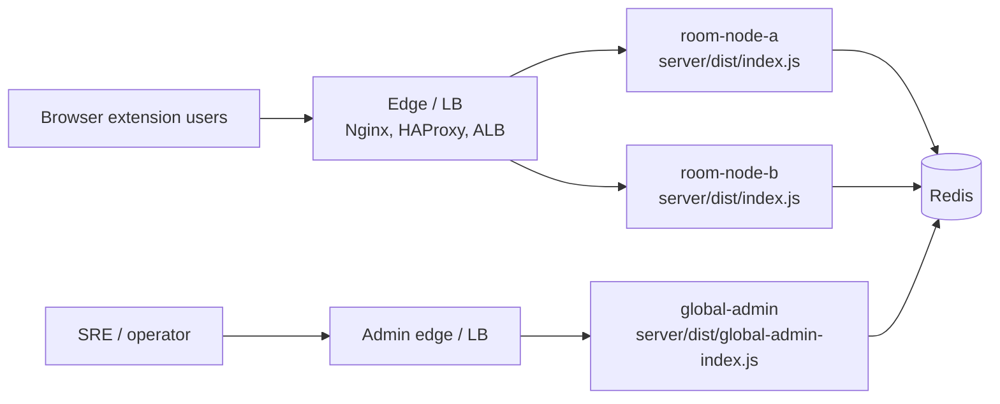

# Bili-SyncPlay 多节点运维 Runbook

[English](./multi-node-operations.md) | [简体中文](./multi-node-operations.zh-CN.md)

本文档面向日常运维和应急值班，覆盖多 Room Node、独立 Global Admin 与 Redis
共享控制面的扩容、缩容、Redis 故障、管理员口令轮换和常见告警定位。

## 适用范围

- 普通用户通过统一入口访问 `wss://sync.example.com`。
- Room Node 运行 `server/dist/index.js`，负责 WebSocket、`/healthz`、`/readyz`。
- Global Admin 运行 `server/dist/global-admin-index.js`，负责 `/admin` 与
  `/api/admin/*`。
- Redis 承载房间基础状态、运行时索引、事件流、审计流、房间事件总线、管理员会话和管理命令总线。

## 拓扑



Room Node 不内置负载均衡。生产入口层必须负责 TLS 终止、WebSocket 反向代理和连接分发。
WebSocket 是长连接流量，入口层优先使用 `least_conn`，再考虑轮询；sticky
路由只作为上线初期的运维兜底，不是多节点正确性的必要条件。

## 基线配置

所有 Room Node 与 Global Admin 应指向同一个 Redis，并保持以下配置一致：

```bash
REDIS_URL=redis://10.0.0.11:6379
ROOM_STORE_PROVIDER=redis
ADMIN_SESSION_STORE_PROVIDER=redis
ADMIN_EVENT_STORE_PROVIDER=redis
ADMIN_AUDIT_STORE_PROVIDER=redis
RUNTIME_STORE_PROVIDER=redis
ROOM_EVENT_BUS_PROVIDER=redis
ADMIN_COMMAND_BUS_PROVIDER=redis
NODE_HEARTBEAT_ENABLED=true
```

每个进程必须使用唯一 `INSTANCE_ID`。Room Node 使用 `PORT` 监听业务流量，并设置
`GLOBAL_ADMIN_ENABLED=false`；Global Admin 使用 `GLOBAL_ADMIN_PORT`，并设置
`GLOBAL_ADMIN_ENABLED=true`。

如果设置了 `REDIS_NAMESPACE`，它会作为所有 Redis 键和频道（房间、运行时索引、事件流、房间事件总线、管理命令总线）的前缀，因此所有 Room Node 与 Global Admin 必须使用同一个值；全部不设置时共同使用默认前缀 `bsp`。命名空间不一致会把集群分裂——表现为 Global Admin 看不到房间和心跳、跨节点广播与管理命令静默失效。

生产环境还应显式配置并保持一致：

- `ALLOWED_ORIGINS`
- `TRUSTED_PROXY_ADDRESSES`
- `MAX_MEMBERS_PER_ROOM`
- `MAX_MESSAGE_BYTES`
- `ADMIN_USERNAME`
- `ADMIN_PASSWORD_HASH`
- `ADMIN_SESSION_SECRET`
- `ADMIN_SESSION_TTL_MS`
- `ADMIN_ROLE`

## 常用验证命令

```bash
# Redis 连通性
redis-cli -u "$REDIS_URL" ping

# Room Node 健康检查
curl -fsS http://10.0.0.11:8787/healthz
curl -fsS http://10.0.0.11:8787/readyz

# Global Admin 健康检查
curl -fsS http://10.0.0.11:8788/healthz
curl -fsS http://10.0.0.11:8788/readyz

# Prometheus 文本指标
curl -fsS http://10.0.0.11:8787/metrics

# systemd 日志
sudo journalctl -u bili-syncplay-room-node-a -f
sudo journalctl -u bili-syncplay-global-admin -f
```

示例中的 systemd 单元名沿用[部署指南](../operations/deployment.zh-CN.md)的按节点命名方案（`bili-syncplay-room-node-a`、`bili-syncplay-room-node-b`……），实际操作时替换为目标节点对应的单元名。

如果部署了独立指标端口，使用 `METRICS_PORT` 对应地址抓取 `/metrics`。

## 扩容 Room Node

目标：新增一个 Room Node，并让入口层开始分发新连接。

1. 选择唯一实例名，例如 `room-node-c`。
2. 在新机器安装 Node.js 22、依赖和构建产物，版本应与现有节点一致。
3. 配置与现有节点一致的 `REDIS_URL`、provider、安全、限流、房间容量和 admin
   认证变量。
4. 配置唯一变量：

   ```bash
   INSTANCE_ID=room-node-c
   PORT=8787
   GLOBAL_ADMIN_ENABLED=false
   ```

5. 启动服务：

   ```bash
   sudo systemctl enable --now bili-syncplay-room-node-c
   sudo systemctl status bili-syncplay-room-node-c
   ```

6. 在入口层加入新 upstream，但先设置较低权重或仅灰度少量流量。
7. 验证新节点：

   ```bash
   curl -fsS http://10.0.0.13:8787/readyz
   curl -fsS http://10.0.0.13:8787/metrics
   ```

8. 登录 Global Admin，确认概览中出现 `room-node-c`，且心跳时间持续刷新。
9. 创建测试房间，让一个客户端连到旧节点、另一个客户端连到新节点，验证共享视频和播放状态能跨节点同步。
10. 观察 10 到 15 分钟，确认错误率和 Redis 延迟稳定后，把入口层权重调整到目标值。

扩容完成标准：

- `/readyz` 返回 200。
- Global Admin 概览里新节点 `health` 为 `ok`。
- `bili_syncplay_connections` 随入口层分发出现合理增长。
- `bili_syncplay_redis_operation_failures_total` 无持续增长。

## 缩容或安全下线 Room Node

目标：不再接收新连接，等待或迁移现有房间，然后关闭单个节点。

1. 在入口层把目标节点从 upstream 移除，或把权重设为 0。
2. 保留进程运行，不要立刻停止服务。
3. 在目标节点观察连接数：

   ```bash
   curl -fsS http://10.0.0.12:8787/metrics | grep bili_syncplay_connections
   ```

4. 在 Global Admin 查看该节点仍承载的房间和 session。
5. 对仍有活跃成员的房间，优先通知用户短暂重连；客户端重连会经入口层进入其他节点。
6. 如果必须立即迁移，使用 Global Admin 对目标节点上的 session 执行断开会话动作。不要删除房间，房间基础状态在 Redis 中保留，用户可用 `roomCode + joinToken` 重连。
7. 等 `bili_syncplay_connections` 降到 0，或确认剩余连接已按变更窗口处理。
8. 停止目标节点：

   ```bash
   sudo systemctl stop bili-syncplay-room-node-b
   ```

9. 等待至少一个 `NODE_HEARTBEAT_TTL_MS` 周期，确认 Global Admin 中目标节点消失或标记为过期。
10. 从入口层配置中永久删除该 upstream，并 reload 入口层。

缩容完成标准：

- 入口层不再向目标节点转发新连接。
- 目标节点 `bili_syncplay_connections` 为 0。
- Global Admin 不再展示目标节点为健康活跃。
- 其他 Room Node 的 `/readyz` 和跨节点同步正常。

## Redis 故障处理

当 provider 配置为 `redis` 时，Bili-SyncPlay 不会自动无感切换到 in-memory。
Redis 在启动阶段不可用会导致相关进程启动失败；运行中 Redis 异常会影响房间持久化、运行时索引、跨节点广播、管理员会话、审计事件和管理命令。

### 快速判断

```bash
redis-cli -u "$REDIS_URL" ping
curl -fsS http://10.0.0.11:8787/readyz
curl -fsS http://10.0.0.11:8787/metrics | grep bili_syncplay_redis_operation_failures_total
sudo journalctl -u bili-syncplay-room-node-a --since "15 min ago" | grep -E "redis|Redis|node_heartbeat_failed"
```

同时检查 Global Admin 概览：

- Room Node 心跳是否过期。
- Redis 相关 provider 是否仍为 `redis`。
- 房间列表、房间详情和事件流是否返回错误或明显延迟。

### 优先恢复 Redis

1. 确认 Redis 进程、磁盘、内存、网络 ACL 和密码。
2. 如果使用托管 Redis，先完成主从或实例故障切换，保持 `REDIS_URL` 指向可用实例。
3. Redis 恢复后重启受影响进程：

   ```bash
   sudo systemctl restart bili-syncplay-room-node-a   # 每个 Room Node 依次执行
   sudo systemctl restart bili-syncplay-global-admin
   ```

4. 验证 `/readyz`、Global Admin 概览、跨节点同步和 Redis 错误计数。

### 应急降级到 in-memory

只有在 Redis 无法及时恢复、且业务可接受短期单节点或弱多节点能力时才使用此方案。

降级配置：

```bash
ROOM_STORE_PROVIDER=memory
ADMIN_SESSION_STORE_PROVIDER=memory
ADMIN_EVENT_STORE_PROVIDER=memory
ADMIN_AUDIT_STORE_PROVIDER=memory
RUNTIME_STORE_PROVIDER=memory
ROOM_EVENT_BUS_PROVIDER=memory
ADMIN_COMMAND_BUS_PROVIDER=memory
NODE_HEARTBEAT_ENABLED=false
```

降级影响：

- Redis 中已有房间不会被 in-memory 节点读取，用户可能需要重新建房或重新加入。
- 房间状态、运行时 session、管理员会话、事件和审计日志退回进程本地。
- Global Admin 只能可靠管理当前进程可见的本地状态。
- 跨节点 room state fanout 和跨节点管理命令不再具备生产语义。
- 多 Room Node 同时使用 in-memory 时，入口层必须启用 sticky，或临时只保留一个 Room Node 承接业务。

降级步骤：

1. 宣布应急模式，冻结扩缩容和管理批量操作。
2. 从入口层只保留一个 Room Node，或打开 sticky 路由并降低变更频率。
3. 修改 Room Node 和 Global Admin 环境变量为上述 in-memory 配置。
4. 重启服务：

   ```bash
   sudo systemctl restart bili-syncplay-room-node-a   # 每个 Room Node 依次执行
   sudo systemctl restart bili-syncplay-global-admin
   ```

5. 验证 `/readyz`、登录后台、创建测试房间和播放同步。
6. 在公告中说明旧房间可能不可恢复，需要用户重新建房或重连。

### 从 in-memory 恢复到 Redis

1. 确认 Redis 已稳定，`redis-cli -u "$REDIS_URL" ping` 返回 `PONG`。
2. 把所有 Room Node 和 Global Admin 的 provider 切回 `redis`，并恢复
   `NODE_HEARTBEAT_ENABLED=true`。
3. 先启动一个 Room Node 和 Global Admin，验证后台登录、创建房间、事件流和 `/metrics`。
4. 逐个恢复其他 Room Node，每次只加入一个 upstream。
5. 观察 `bili_syncplay_redis_operation_failures_total` 和 Redis 延迟至少 15 分钟。

## 管理员口令轮换

目标：更换后台密码，必要时同时轮换会话 secret，使旧 token 失效。

1. 生成新密码哈希。当前支持 `sha256:<hex>` 和 `scrypt:<salt>:<base64url>`；[安全相关环境变量参考](../reference/security-env.zh-CN.md)
   中的快速命令使用 `sha256`：

   ```bash
   node -e "const { createHash } = require('node:crypto'); console.log('sha256:' + createHash('sha256').update(process.argv[1]).digest('hex'));" 'new-admin-password'
   ```

2. 将新 `ADMIN_PASSWORD_HASH` 写入密钥系统或部署配置。
3. 如需强制所有现有后台 token 失效，同时生成并分发新的 `ADMIN_SESSION_SECRET`：

   ```bash
   node -e "console.log(require('node:crypto').randomBytes(32).toString('base64url'))"
   ```

4. 同步更新所有 Room Node 与 Global Admin。多节点部署中这些 admin 认证配置必须一致。
5. 滚动重启：

   ```bash
   sudo systemctl restart bili-syncplay-room-node-a   # 每个 Room Node 依次执行
   sudo systemctl restart bili-syncplay-global-admin
   ```

6. 打开 `/admin`，用新密码登录。
7. 执行只读验证：查看概览、房间列表、事件和审计日志。
8. 执行最小写操作验证时使用测试房间，避免误操作生产房间。
9. 确认旧密码无法登录；如果轮换了 `ADMIN_SESSION_SECRET`，确认旧页面刷新后需要重新登录。

## Global Admin 重启

Global Admin 不承载 WebSocket 房间流量，可独立滚动重启。

```bash
sudo systemctl restart bili-syncplay-global-admin
curl -fsS http://10.0.0.11:8788/readyz
```

如果 `ADMIN_SESSION_STORE_PROVIDER=redis` 且 `ADMIN_SESSION_SECRET` 未变，已有后台会话可继续使用；如果使用 `memory` 或轮换了 secret，管理员需要重新登录。

## 常见告警与定位

| 告警或现象                                     | 主要指标 / 信号                                                                | 优先检查                                               | 处理方向                                            |
| ---------------------------------------------- | ------------------------------------------------------------------------------ | ------------------------------------------------------ | --------------------------------------------------- |
| WebSocket 连接数异常下降                       | `bili_syncplay_connections`                                                    | 入口层 upstream、Room Node `/readyz`、进程日志         | 恢复节点或从 LB 摘除异常节点                        |
| 活跃房间数异常下降                             | `bili_syncplay_active_rooms`、`bili_syncplay_rooms_non_expired`                | Redis 连通性、房间过期配置、重启记录                   | 恢复 Redis，确认 `ROOM_STORE_PROVIDER` 未被改为内存 |
| Redis 操作失败                                 | `bili_syncplay_redis_operation_failures_total`                                 | Redis 进程、网络、ACL、密码、慢查询                    | 优先恢复 Redis；必要时执行应急降级                  |
| Redis runtime store 延迟升高                   | `bili_syncplay_redis_runtime_store_duration_seconds_bucket`                    | Redis CPU、内存、网络 RTT、命令排队                    | 扩容 Redis 或降低入口层流量                         |
| Redis room event bus publish 延迟或失败        | `bili_syncplay_redis_room_event_bus_publish_duration_seconds_bucket`、失败计数 | Redis pub/sub 连通性、网络抖动、Room Node 日志         | 恢复 Redis 与网络；验证跨节点播放同步               |
| 连接被拒绝增加                                 | `bili_syncplay_ws_connection_rejected_total`、结构化日志 `origin_not_allowed`  | `ALLOWED_ORIGINS`、入口层是否改写 Origin               | 修正 Origin 白名单或反代配置                        |
| 限流增加                                       | `bili_syncplay_rate_limited_total`                                             | 来源 IP、入口层转发真实 IP、`TRUSTED_PROXY_ADDRESSES`  | 调整限流或修正代理地址配置                          |
| 消息处理耗时升高                               | `bili_syncplay_message_handler_duration_seconds_bucket`                        | Node CPU、Redis 延迟、房间成员数、日志中的错误         | 限流、扩容 Room Node、排查慢 Redis                  |
| Global Admin 看不到某个节点或节点显示过期      | Global Admin 概览、`node_heartbeat_failed` 日志                                | `NODE_HEARTBEAT_ENABLED`、`INSTANCE_ID`、Redis runtime | 修复心跳配置或 Redis runtime store                  |
| 后台登录失败或频繁要求重新登录                 | `/api/admin/auth/login` 响应、审计日志                                         | `ADMIN_PASSWORD_HASH`、`ADMIN_SESSION_SECRET` 是否一致 | 同步 admin 认证配置并重启                           |
| 跨节点房间动作失败，例如踢人或关闭房间返回 502 | 审计日志、`ADMIN_COMMAND_BUS_PROVIDER`、目标节点心跳                           | 管理命令总线、目标 `INSTANCE_ID`、Redis                | 恢复 Redis command bus 或在目标节点本地操作         |

排障时优先同时查看：

```bash
curl -fsS http://<room-node>:8787/metrics
curl -fsS http://<room-node>:8787/readyz
curl -fsS http://<global-admin>:8788/readyz
sudo journalctl -u bili-syncplay-room-node-a --since "30 min ago"
sudo journalctl -u bili-syncplay-global-admin --since "30 min ago"
```

## 变更后回归清单

- 新建房间、加入房间、共享视频、播放 / 暂停 / seek 同步正常。
- 至少两个客户端经不同 Room Node 仍能同步。
- `/healthz`、`/readyz`、`/metrics` 在每个节点上可访问。
- Global Admin 可登录，并能查看概览、房间、事件和审计日志。
- 测试房间上的 `disconnect session`、`kick member`、`close room` 动作符合预期。
- `bili_syncplay_redis_operation_failures_total` 无持续增长。
- 入口层 upstream 与实际在线节点列表一致。
